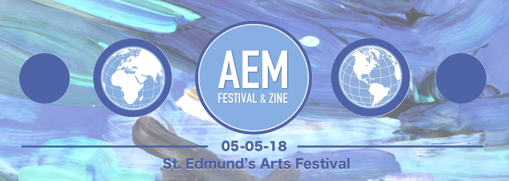
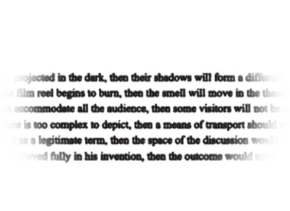
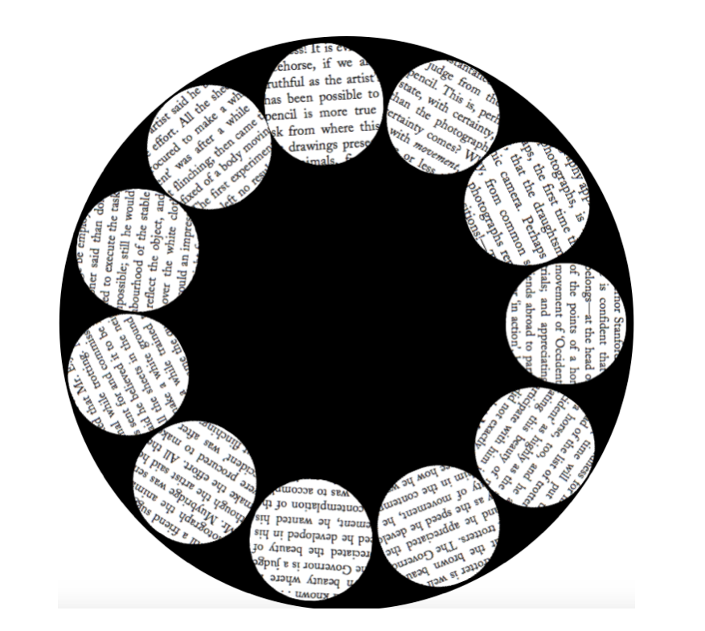
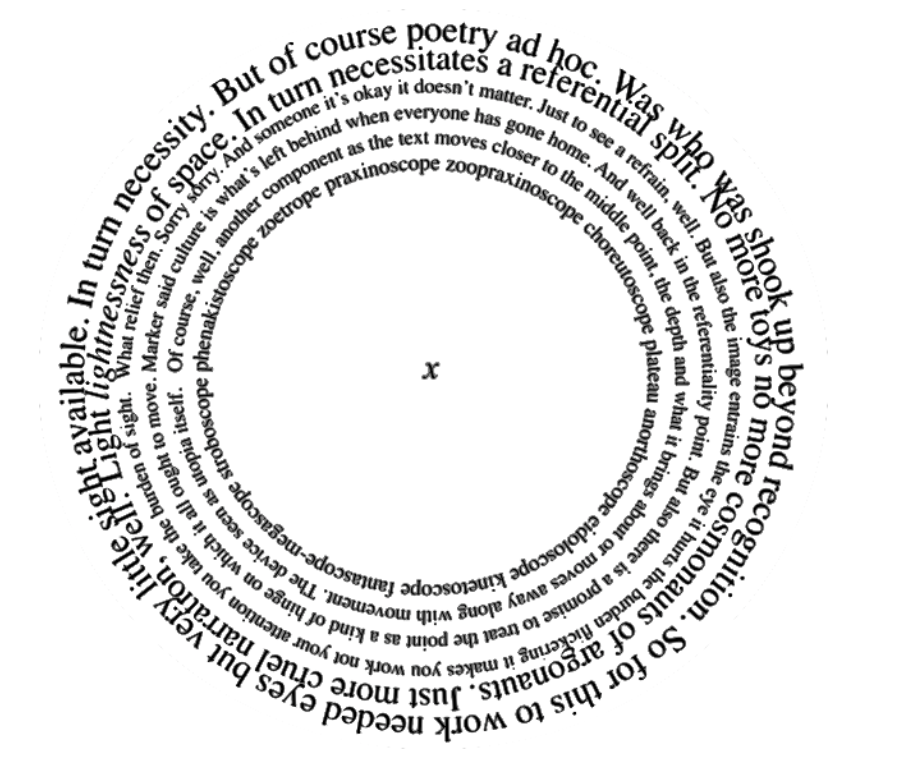

 
 
 
 
 
 
 
 
 
 
 
 
 
_Ars et Mundus_ was the first art festival organised by St Edmund's College, showcasing visual art (paintings, photographs, videos), musical performances and literary pieces of the students of St Edmund's College, Cambridge. 
 
 

<h2>SHEEP ATTACK</h2> 
<h3>Marco Bitschnau - St Edmund’s College</h3> 
  
SHEEP ATTACK ATTACK
 
BITE BLOOD ATTACK BLOOD  
SHEEP SHEEP MALE FEMALE  
BITE BLOOD ATTACK BLOOD  
FIRST FIGHT IN OCTOBER  
THEN FIGHT IN NOVEMBER  
FIGHT BLOOD DEAD EYE  
LOST LEG MAD CRY
 
SHEEP ATTACK ATTACK  
SHEEP ATTACK ATTACK  
 
DISPLAY NOW YOUR BONES  
YOUR NAKED COPPER BONES  
DISPLAY NOW YOUR SHACKLES  
DISPLAY NOW YOUR WRATH  
ERASE WITH YOUR HORNS  
YOUR SPLENDOROUS HORNS  
THE SPRUCE AND THE PILLAR  
THE KEY AND THE PALACE  
THE MULBERRY TREES
AND TEMPLES ABANDONED  
THEY CANNOT RESIST YOU  
THEIR FLUFFY HEADS SMASHED  
THEIR CARCASSES FLOATING
IN RIVERS OF HONEY
THE ORDER, A SPHINX  
DESTROYED, BUT WHAT FOR?  
 
SHEEP ATTACK ATTACK
BITE BLOOD ATTACK BLOOD  
SHEEP SHEEP GENDERLESS  
BITE BLOOD ATTACK BLOOD  
FIRST FIGHT IN OCTOBER  
THEN FIGHT IN NOVEMBER  
FIGHT BLOOD DEAD EYE  
LOST LEG MAD CRY
YET ATTACKING
YET ATTACKING  
  

<h2>Languages</h2> 
<h3>Dan Fodor - St Edmund’s College</h3> 
 
Uneori, 
ce simt - 
se vrea pe românește.  
 
Other times, 
my feelings 
dance with English - 
 
But times and times again, 
they do 
wanna speak 
in languages  
I don't  
even know. 
 
<h2>406 east 50th street</h2> 
<h3>Jonathan Chan - Wolfson College</h3> 
 
i am as tall as
the garage door now. 
 
 
i lay across the steps
that lifted boots 
damp from crunched
snow. 
 
i peer in the
kitchen, i knew it by
the finish of wooden
counters and peanut
butter breakfasts. 
 
i have
spent the week tracing
imaginary footsteps,
breathing parallel 
universes, missing 
the thoughts and values 
and friends and prayers 
that never came
to be. 
 
i see my life, one
step removed, one world
away, one history untold, 
hidden in the swathes 
of concrete and
whispers of time. 
 
<h2>es muss sein</h2> 
<h3>Johanna Winder - Peterhouse</h3> 
 
sun bites relentless 
through the canopy – 
air thick with mosquitoes 
bears down on her, with the weight 
of heavy dread – 
humid despair 
 
rivulets of sticky sweat 
run over her pounding scalp 
down her forehead, stopping 
on the precipice that is her eyebrow 
before crashing down onto an eyelid 
in a wave of blinding, salty tears 
 
when will this end? 
my lungs –  are full 
of water 
 
it will not end – 
despite the advancing blindness 
its asymptotic existence 
results in a perpetual almost 
 
in the icy glow of a winter moon 
it is difficult to imagine 
being so acutely warm 
yet the dull, throbbing pain 
at the base of her skull 
feels so familiar 
 
there is a spider in my head 
crawled into my mouth while I slept 
and now under the curve of my cranium – 
it has come to rest 
 
a web of terror shrouds her – 
shivering as the city sweats 
its layers of ice and snow 
to birth a swollen river 
whose smooth underbelly 
is tarnished with scattered 
glacial fragments 
 
peel off 
its broken grimy skin 
scratch at healing flesh to  
get to the root of the itch 
scrape through skin and sinew to 
get down to the bone 
 
if I could just 
get down to the bone of it all 
 
feral night creatures 
gnaw at the ghostly skeleton 
feeding the earth with its 
pervasive marrow 
 
it is eating away at me and I cannot 
escape the jaws of the beast 
 
and as spring soaks the earth 
she begins to unfurl her curlicue spine 
and stretch her roots 
like rays of that agonising sun – 
she will run 
deep into the undergrowth 
 
<h2>Dandelion seeds floating out over Lyme Bay (and away)</h2> 
<h3>Tom Pryce - King’s College</h3> 
 
A whirl of glistening dandelion seed, 
Caught up on the spirit of a mirror that breathes: 
Wonderment, an always-past moment, 
Carried by the fleeting current; 
 
A spray of snowflakes floating in space where all things which pass pass slower, 
Drifting serene on the amber of afternoon sun which will make each of them a flower, 
In the echoing shadow of a fisherman’s line, cast from atop clay slopes of the Black Ven, 
Floating across its primordial waters, trickling down melodies to rejoin the sea again. 
 
To the waves of rippling, sleeping rows, smoothed granites and striped chrome of Lyme, 
A weaving Jurassic field ploughed anew, each day by immemorially turning tide, 
The spindling toes of giant’s feet, at the expanse which will swallow, redeal each rock, 
A gleaming silk sheet of gently rippling lilac, loosely drawn, twilight, glistening table cloth. 
 
The swept pebbles a Labyrinth estuary, narrowing to earthen streams before tumbling falls, 
Tributaries that feed seas growing to where we saw a puff of brushstroke dandelion before, 
Among tall reeds which weave around the ankles of greying sheep caught just for a moment, 
In the great cycle of Renoir’s Return from the Field, holding us there in its silence. 
 
<h2> The Wait </h2> 
<h3>Misbah Khatana - Girton College</h3> 
 
“Breaking a hip at 92 she won’t last too long,” Mansoor thought. He sipped the drink the airhostess handed him and tried to twist himself into as much comfort as his cramped airplane seat could provide. He had taken 10 days off from his job but wondered now if two weeks might have been more appropriate. There would be the funeral when his mother died, and a few days later, (nobody would think he’d wait out the full forty days generally considered proper) the feast. His mother had almost reached a hundred, people would expect him to have a grand meal and he didn’t want to disappoint. Yes, he mulled wishing he could have a cigarette, perhaps two weeks would have been better. It depended when she went.  
 
The flight there took almost a whole day and he dozed for most of the six hours of the drive from the airport to his village. He chose to sit in the back seat of the car his cousin had sent to get him, and the times when he was awake, he made conversation with the driver. Even in the air-conditioned closed vehicle he breathed the dust he had grown up in, and over the years living away, had grown to despise.  
 
The driver pointed out sights as if he were a tourist rather than a son returning home. Mansoor ignored him most of the time and took in the mountains, fields and dust as it blurred past. It was difficult to make out anything in the horizon because of the near blinding sun. No wind blew, hardly anything in front of them moved and the intense sun made everything look hazy. Behind them was another matter; the wheels of their SUV disturbed the dry dirt track they travelled over and caused a linear dust storm that wound behind them like a sooty, sandy snake.  
 
"What's that?" he asked suddenly.  
 
Not far from them part of a hamlet lay in ruins. Once white walls seemed to be blackened and parts of walls and roofs had fallen in on themselves.  
 
“Oh that was many months ago Saab,” the driver said, using the title servants generally used for people of higher rank,  
 
“Nobody lives there any more. The enemy came and threw some of their special bombs on it.”  
 
“I heard someone blew himself up.”  
 
“No, no, that was at the shrine, next to the Madrassa” The driver replied fiddling with the air-conditioning. “During the Urs, the Sufi saint’s death anniversary...that was before this blast, about 50 miles from here.”  
 
“Not too near home then.” He took out his iPhone to see if he could use it in his native country. “Suraya’s children go to a Mudrassa don’t they?”  
 
“Her son, Saab.”  
 
<h2>The numbness of (the) age</h2> 
<h3>Isabelle Burroughes - Homerton College</h3> 
 
Pulsing in 
and out 
of life… 
 
like a sequence of flashing lights. 
 
Memory; the alluring edge of a bubble. 
Asking me to pass through the kaleidoscope of pain, to remember 
the antiquated past. 
Roots, that’s what they say, don’t forget your roots. 
But I feel like mine have all been pulled up, torn and devoured in the cannibalistic carnage that we call society. 
 
Consciousness hammering 
against the confines of my fragile skull. 
I am like a man wrapped in exhausted lightbulbs, 
A man with a soul worn down like a razor dulled 
by too many strokes of the flesh. 
But I am a woman who’ll be recycled again tomorrow, 
joining the muscles of those primordial fathers who have gone before us. 
 
If only we could repeat time like we can repeat a song, replaying our favourite verse 
over and 
over 
and over 
again. 
If only time was easier to translate 
and innocence not given an expiry date. 
Time… 
The tick, tock, 
of the corporate clock? 
Or simply the change of the wind? 
 
<h2>Zodiac</h2> 
<h3>Deepa Iyer - Gonville and Caius College</h3> 
 
I wish I had broken into two equal halves  
When he left me.
Or at least, in countable parts,
With all the internal organs intact.  
I hear that liver can grow again
Like heart, like new parts of brain,  
When sense dawns.
But with all the bladders and coils,  
That divert memories from the raw  
To digested and discarded,
There is no second chance.
Blowing up into smithereens
Spurts the molten magma inside
Into indecipherable landscape, art.  
You are stuck with the new carapace.  
What is worse is the little things
You did not ask for,
Like sympathy wings or a pity tail.  
 
<h2>Divorce in 26 letters</h2> 
<h3>Caroline Banerjee - Sidney Sussex College</h3> 
 
When the last train pulls away, 
You take a free city map 
And rip it neatly down the centre. 
 
I get first pick. 
I choose the secret garden with the stream, 
The coffee shop that has glow in the dark stars, 
The chip shop which 
sometimes runs out of fish (and chips). 
 
You choose the park with the sun dial, 
The smiling guy who teaches guitar for a fiver, 
The only hill that has enough gradient 
For a plastic sledge. 
We share the kids. 
 
I watch you gather the alphabet and 
Slot the letters back into dictionary order, 
‘U’ and ‘I’ 
Stare out at each other from border controlled pages. 
 
I sign on the dotted line, 
something falls between. 
 
<h2>the syntax of things</h2> 
<h3>Sarah Davis - St Edmund’s College</h3> 
 
the months pass and you wait for the flowers to bloom, 
as always. 
yesterday you pulled yourself to pieces and glued each fragment back together, 
one by one, 
pressing them together until you were whole again. 
each part is a tiny bit off centre, 
so that when you step back 
everything is wholly intact but wholly new. 
this is what you were built from. 
 
here is the room with the locked doors, 
the candles lit up and dripping their wax onto the hard-wood floor. 
the musty air and the feeling of being fourteen 
and curling yourself further into your seat 
as if you could carve away a place to hide 
until you’re ready for it all. 
 
here is the room with the red curtains, 
the cotton bedsheets and the crumbs scattered over the floor. 
the cloying heat falling through the window, 
your body sticky with sweat and hope. 
 
here is the room where you fall in love. 
here is the other one. 
stack them up, 
line them up like books, 
order them by letter, by colour, by taste and memory. 
 
the snow falls and covers everything in hushed tones. 
it melts and spells out your deepest secrets on your eyelashes. 
 
here is the last room: 
it is filled with orchids and it tastes like the ocean. 
 
open your hands. 
this is what you are left with. 
this is the sculpture of disintegration. 
 
<h2>Visita al Doctor</h2> 
<h3>Luisfer Rivera - St Edmund’s College</h3> 
 
Si cruzando una mirada a los ojos con la persona, siente una vibración energética que inicia en la base del cráneo y se desliza por toda la espalda, provocando el enfriamiento súbito del raquis, y, al mismo tiempo, experimenta un brusco incremento de la temperatura en el resto del ser, entonces es amor lo que tiene. 
 
Si, por el contrario, lo que se manifiesta es una ininterrumpida desconexión entre el circuito sanguíneo y los pulmones, como la conmoción respiratoria que se tiene previo al pánico, entonces se trata de una ilusión. 
 
Antes de que me responda, en mi opinión profesional, ambas pueden ser letales, siendo la segunda mucho más peligrosa por sus efectos en el corto plazo, que incluirán una disminución de las capacidades cognitivas cuando se encuentre expuesto al factor contaminante, o la persona. Esto suele tener consecuencias irreversibles. 
 
La ilusión se caracteriza por la creación continua de escenarios platónicos e ideales, en donde la persona hace y dice exactamente lo que la mente del sujeto requiere para reiniciar el proceso cerebral de gratificación y expectativa. 
 
En casos severos, pueden presentarse alucinaciones, provocadas por la cada vez mayor necesidad de dopamina y que, afectará irreparablemente nuestra percepción de lo que es real. 
 
Esta realidad, la verdadera realidad, es usualmente burlada con una confirmación de lo no real mediante conversaciones con personas cercanas, que no pueden evaluar la veracidad de las afirmaciones del paciente. 
 
<h2>Grief, in translation</h2> 
<h3>Ralie Belcheva - Trinity College</h3> 
 
(transcript of a therapy session) 
I wish I had the words to tell you 
about the types of candles 
in our church. 
 
I wish I had the grammar to describe 
the different ways to handle 
covered mirrors. 
 
But I cannot make it clearer 
than a litany of metaphors 
for loss - which get lost in translation; 
an entire nation’s worth of grief 
that I cannot describe. 
My textbooks never taught me 
how to grieve in English too 
and it’s been easy to forget the loving memories 
and to distinguish between the sadness and the work 
when sadness lurks outside 
the borders of your spoken language. 
And yet I cannot sentence it 
to languish, inside a pile of sentences, 
untouched - 
but talking is too much 
and I have no strength to add footnotes. 
 
<h2> the love letter is an epitaph</h2> 
<h3>Zooey Ziller - Wolfson College</h3> 
 
she walked amongst the sombreness 
of the winter branches, doubled 
hauntingly in the water, dissolved and 
immaterial, and rendered as they were, 
unreal.  upon its undulating surface, the object trembles 
and dissolves in the depths of her memory.  it was 
structural, there was a diffusion; in despair, 
she was engulfed.  now, she thought, 
here the past is dictating to you. 
 
the space experienced transcends its 
geometrical reality; it becomes a great image of intimacy 
lost.  it consumes itself, it perpetuates itself, nobody 
inhabits it, yet a consciousness it situated inside the walls. 
reminiscence, rather than being a phenomenology of the mind, 
is a phenomenology of the soul, a process permanently  
involved 
 
in resurrecting that which is dying, to return like 
a ghost, those retrievals, whose untidy gestures coalesce and 
echo throughout the past. 
 
 
to walk was an experience of tiny deportations and 
displacements.  like Orpheus, whose steps syncopated with  
the temporality 
 
of grief, she sought an arresting rapprochement of the past. 
sustained, carried in a state of eternal suspension, it 
posits you, caresses you, with its gesture that is endless,  
inhabiting you like 
 
a memory; it does not fill, but allows something vacant to  
settle 
 
within, an inconsolable longing to be suffered and endured. 
disembodied, disconsolate, the image of the beloved  
speaks, enmeshing  
 
itself in the tonality, the cadence,     
of the past. 
 
<h2>Jaka Lombar - Queens’ College</h2> 
 
<h3>I.</h3> 
 
 
 
<h3>II. </h3> 
 
Circular motion, or rather the shape of one’s iris, 
or rather the way a still photograph moves, or rather still 
the way a force will act on all matter in equal distance, 
or perhaps not a horse cut in half, or even the recycled words of 
the much needed reassurance that a public is forming 
around an apparatus … There is a conditional nature  
in what one sees, the partiality extended beyond  
the protasis and the apodosis. Squint your eyes,  
and you will change the image in front of them, 
as if the muscle balance can affect the movement of  
the world withdrawn. A lesson on names, 
or speed of pronunciation. Ultimately,  
a matter of memory, but before the silence of legacy, 
an adventure that precedes the flight unseen. 
Of course the contingency will spill over if uncontained, 
one might begin with “Ead” or “Bellicorum instrumentorum  
liber, cum figuris et fictitys litorisconscriptus”. Yet there is 
a certain pleasure in animating a wild beast which was rendered 
to a size of a salamander.  
A primordial screen, almost,  
where the sign has not yet fully 
addressed its indexical nature, its temporal promise to deliver 
movement from the centre of the surface. And in that centre 
lies a point and an x. 
  
<h3>III.</h3> 
  
 
 
<h3>IV.</h3> 
  
 
 
 
<h2>Remains of/on the Beach</h2> 
<h3>Evelyne Scarborough - Newnham College</h3> 
 

A beach walk down memory lane  
re-collecting shells, souvenirs  
washed up from nicer places, better times. 
One grey fits all from a far, disperses into 
harlequin watercolour upon due attention. 
Immobile indifference at first touch, thaws into 
ardent acquaintance when eagerly embraced. 
 
Meanwhile, intrepid pearl fishers, unfazed by  
deep dark waters, bring back prized bygones. 
Every now and then, I hold a shell to my ear, 
my back to the ocean and listen to what I don't want to see: 
waters left unexplored, precious trophies never claimed. 
La Regrettee, sentenced to self-castigation by salty sting for 
remaining safely on the beach, then and now. 
 
<h2>The beginning</h2> 
<h3>Mariam Haji - Clare College</h3> 
 
You say 
We must get a portrait 
 
But there is one already  
In my mind 
A flashing kind 
Those flashing eyes 
That flashing red 
Frozen 
 
And then the stage was set 
Our audience  
Empty stadium 
Our witnesses  
Ready 
 
Queens for a second 
Broke free 
Ran, spin 
Unfrozen 
 
Flashing red 
In motion 
 
Moment  
forever frozen 
In the lens-eye 
 
But forever treasured in my imagination. 
Run, spin 
 
Dance 
 
Armoured together 
Frolicking down the streets 
So confident  
we 
So careless 
So free 
 
Discovery I said 
Where you said 
Let’s go we said 
 
In that old street 
New plans unfolded 
We schemers  
We two planted 
 
We sowed 
We reaped 
From the fantasies of Old Street 
 
Which bloomed beyond expectation 
 
That last day 
Awkward as hell 
But at least we weren’t left to dwell 
 
Searching for you in the humdrum crowd  
Style 
Lighting up that monochrome 
 
Colouring my world 
 
<h2>Garden of Poetry </h2> 
<h3>Nicole Tamer - St Edmund’s College</h3> 
 
each letter is like a seed  
carefully woven into the fabric  
of the heavy wet words of the earth  
saturated by thoughts like water  
arranged by the spades of memory  
returning to the roots of the rhythm  
 
flowerbeds slowly growing into  
a bouquet of intermingling leaves of reflections,  
traces of observations  
turning into a symbiosis  
of harvested verses 
 

